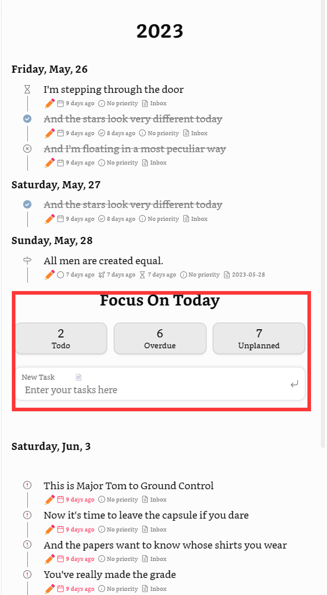
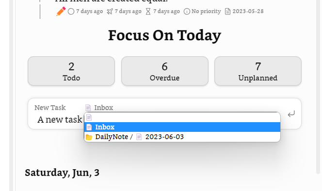
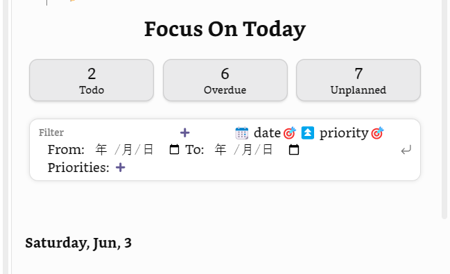
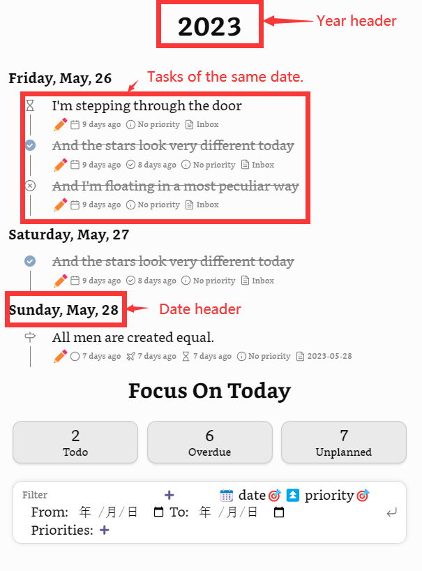
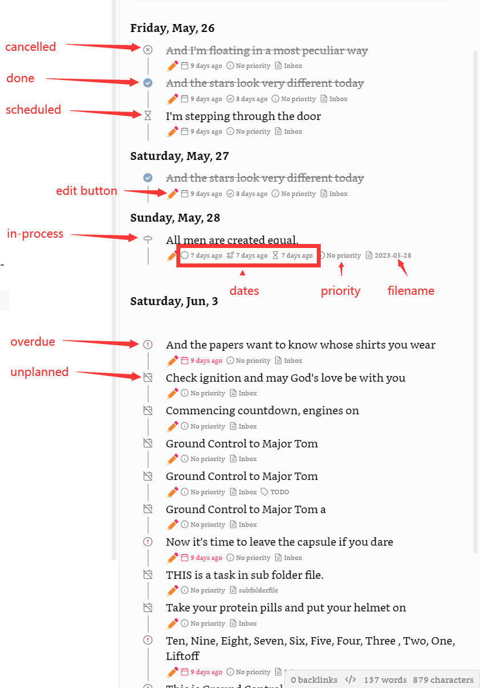
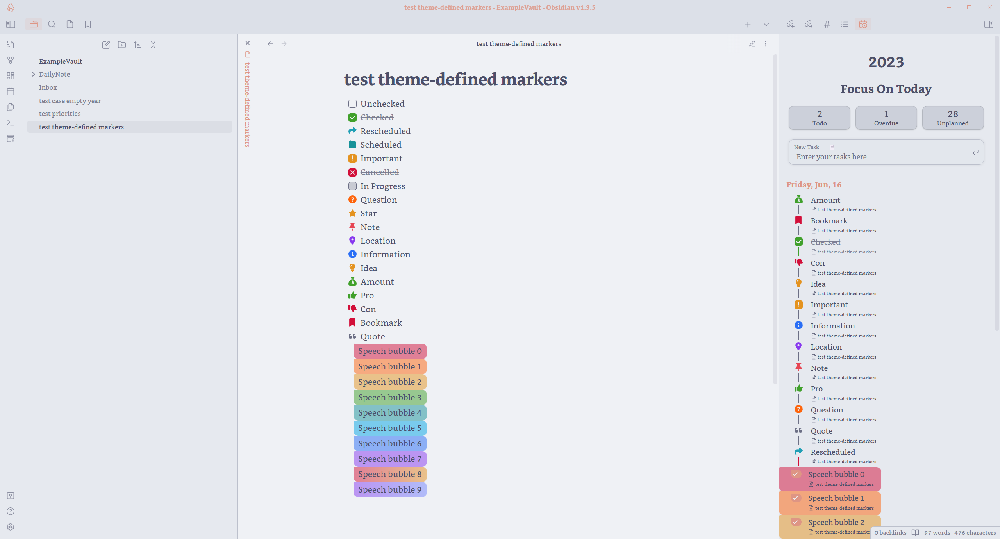

# NEWS about v1.0

I am currently refactoring this plugin with NextUI components, to make this plugin more maintainable and expandable, more features and better visualization will come with this major revision!
Here is a very eary preview, please do leave an issue if you have any thoughts!

# Tasks Calendar Wrapper

This plugin currently provides a timeline view to display your tasks from your [obsidian](https://obsidian.md/) valut, with customizable filters and renderring options.

## Overview

The [ExampleValut](https://github.com/Leonezz/obsidian-tasks-calendar-wrapper/tree/master/ExampleVault) provides an example using this plugin, the screen shot with the [Blue-Topaz](https://github.com/whyt-byte/Blue-Topaz_Obsidian-css) light theme is as follows:

## Features

- Organize taks in a timeline view
- Customizable options
- Quick entry panel for new items and filters

## About

This is a simple wrapper for Obsidian-Tasks-Calendar (https://github.com/702573N/Obsidian-Tasks-Calendar) and Obsidian-Tasks-Timeline (https://github.com/702573N/Obsidian-Tasks-Timeline).

This plugin provides setting pages and update support for [702573N](https://github.com/702573N)'s great work, for detailed information
about the options, see [Obsidian-Tasks-Calendar](https://github.com/702573N/Obsidian-Tasks-Calendar) and [Obsidian-Tasks-Timeline](https://github.com/702573N/Obsidian-Tasks-Timeline).

## Usage

goto command panel and find "Tasks Calendar Wrapper: Open Tasks Timeline View", select the command and the view will show up.

### Date format

For dates of an item, if the item belongs to a daily note, then the date of that daily note will be setted as the item's _created date_. Additionally, the start date and scheduled date will also be setted as to daily note date if these two dates are not otherwise given.

For general date format, it is recommend to use the [Tasks Plugin](https://github.com/obsidian-tasks-group/obsidian-tasks)'s emoji format or the [Dataview](https://github.com/blacksmithgu/obsidian-dataview) format. Both are supported in this plugin.

For example, an item with 2023-06-03 as the start date could be:

- [ ] task that starts at 2023-06-03 🛫 2023-06-03

or:

- [ ] task that starts at 2023-06-03 [start::2023-06-03]

or in a daily note of date 2023-06-03:

- [ ] task that starts at 2023-06-03

## Installation

This plugin is available on the community market.

## Components

There are mainly two components in the timeline view, which are the quick entry panel and the content view.

### Quick Entry

The quick entry panel provides four buttons an one input line.

#### Buttons

The four buttons are: Focus On Today, Todo, Overdue, and Unplanned. With Focus On Today button enabled, only task items that are under 'today's' part are going to be displayed, and the other three buttons 'Focus' or 'Filter' tasks with specific status with corresponding options.

#### Input line

With the input line you can append new task items to predefined sections in selected files, for example, you can append a new task to your 'Inbox' file:

Just some details to make it easier, you can input in the panel with some of the [Tasks-Plugin](https://github.com/obsidian-tasks-group/obsidian-tasks) defined emoji format date, for example, you could input the word 'due' and a blank space, the emoji 📅 will replace the word 'due'. The following word-emoji pairs are now available:

- due: 📅 (for due date)
- start: 🛫 (for start date)
- scheduled: ⏳ (for scheduled date)
- done: ✅ (for done date)
- highest: 🔺 (for priority highest)
- high: ⏫ (for priority high)
- medium: 🔼 (for priority medium)
- low: 🔽 (for priority low)
- lowest: ⏬ (for priority lowest)
- repeat: 🔁 (for recurrence)
- recurring: 🔁 (same as repeat)

Besides, there are some natural language dates support:

- today/tomorrow/yesterday: expand to today/tomorrow/yesterday's date

Another functionality the input line provides is a quick filter, currently data range and priorities based filter are supported, hopefully a tag based filter will be added soon!

### Content

The content component are date-based, to be specific, the task items are organized with their dates. For each date, there could be a date header, and there could be a year head for each year.

#### Task Item Component

For a specific task item, this view displays the item content, status, priority, dates, filename and section (if exists), and the tags. Plus there is a button with a pencil icon to call the task edit modal of the [Tasks Plugin](https://github.com/obsidian-tasks-group/obsidian-tasks) out for editing.

The status are displayed in form of icons, and the other meta-data are displayed with icons and badges.

Since v0.2.1, now you can switch from the builtin icons to theme defined status and icons!

Below is a screen shot with theme [AnuPpuccin](https://github.com/AnubisNekhet/AnuPpuccin).

## Options

Modification to the options will take effect after 5 secs.

- **Use Builtin Style**: Enable plugin defined icons for tasks status or disable them and use those defined by the theme that you prefer.
- **Enable Counters and Filters Panel**: Use counters / filters on the quick entry panel or not, the counters / filters will not be displayed if this option not enabled.
- **Behavior of Counters and Filters Panel**: Control the effect of the counter/filter button, available options are:
  - Focus: Highlight the corresponding items.
  - Filter: Hide other items.
- **Enable Quick Entry Panel**: The quick entry will not be displayed if this option not enabled.
- **Quick Entry Panel Position**: Set the position you would like the quick entry panel to be displayed. Available options are:
  - top: on the first date out of all the dates
  - today: on today's part
  - bottom: on the last date out of all the dates
- **Tasks Files**: Fileanmes separated by ',' to be displayed in the fileselect of the quick entry panel.
- **Inbox**: Set a filename to be your 'Inbox', you can quickly append new tasks to it from the quick entry panel.
- **Section For New Tasks**: Specify under which section the new tasks should be appended.
- **Daily Note Folder**: Specify your daily note folder.
- **Daily Note Format**: Specify in what format your daily note file are named. The input should be a valid moment format, please refer the [docs of moment.js](https://momentjs.com/docs/#/displaying/format/) for more details.
- **Enable Year Header**: Show a year header before each year or not.
- **Hide Tasks of Specific Status**: If you would like not to see tasks with specific status in the view, list the markers separated by ',' here. All markers are available, but do note that if you would like to hide tasks of empty maker, use `[ ]` instead of ` `.
- **Forward Tasks From Past**: If enabled, all unplanned and overdue tasks will be displayed on today's part, and removed form their original dates. If disabled, all overdue tasks will be on their original dates, but all unplanned tasks will disappear.
- **Today Focus On Load**: Enable the Today Focus Button on load or not.
- **Activate Filter On Load**: Select a counter/filter button to be enabled on load. Available options are:
  - No Filters
  - todo
  - overdue
  - unplanned
- **Use Relative Date**: If enabled, the dates will be replaced by description relative to today.
- **Use Recurrence**: Display the recurrence information of an item or not.
- **Use Priority**: Display the priority of an item or not.
- **Use Tags**: If enabled, the tags of an item will be displayed, also you can set color palettes for different tags. If disabled, tags will not be displayed.
- **Hide Tags**: Specify tags that you would like not to see for items in this view.
- **Use Filename**: Display the filenames of items or not.
- **Use Section**: Display the section of items or not.
- **Date Format**: Specify a date format you like the most, the visible dates in this view will be formated as such. Do note the input here should be a valid [moment](https://momentjs.com/docs/#/displaying/format/) format.
- **Sort By**: Specify how would you like the task items in the same date to be sorted. Available options are:
  - (I believe all option texts here explain themselves)
- **Convert Time Prefix**: If enabled, tasks prefixed with a 24-hour timestamp (i.e. "09:00") will be displayed in the timeline with a 12-hour timestamp instead (i.e. "9:00 am"). This is a purely visual option that does not affect sorting, allowing users to display tasks with a 12-hour time format chronologically.
- **Use Include Tags**: If enabled, you could specify tags without which the tasks should not be displayed.
  - **Task Include Filters**: Tasks without any of these tags should not be displayed.
  - **File Include Tags**: Tasks of the files which have none of these tags should not be displayed.
- **Use Exclude Tags**: If enabled, you could specify tags with which tasks should not be displayed.
  - **Task Exclude Tags**: Tasks with any of these tags should not be displayed.
  - **File Exclude Tags**: Tasks of files which have any of these tags should not be displayed.
- **Exclude Paths**: Specify items of which paths should not be counted as tasks. In most of the time your template folder path should be included here.
- **Include Paths**: Specify items of which paths should be counted as tasks.
- **Filter Empty**: If enabled, tasks with empty content will not be displayed. If disabled, the raw text of the empty content tasks will be displayed.

# License

MIT.
